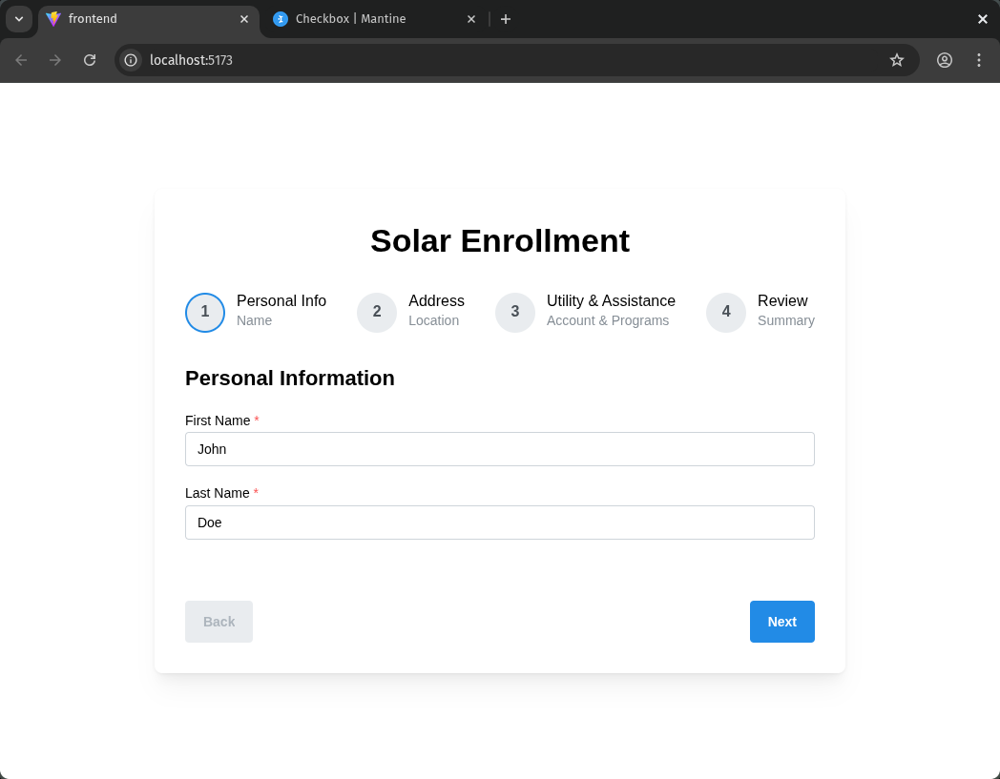
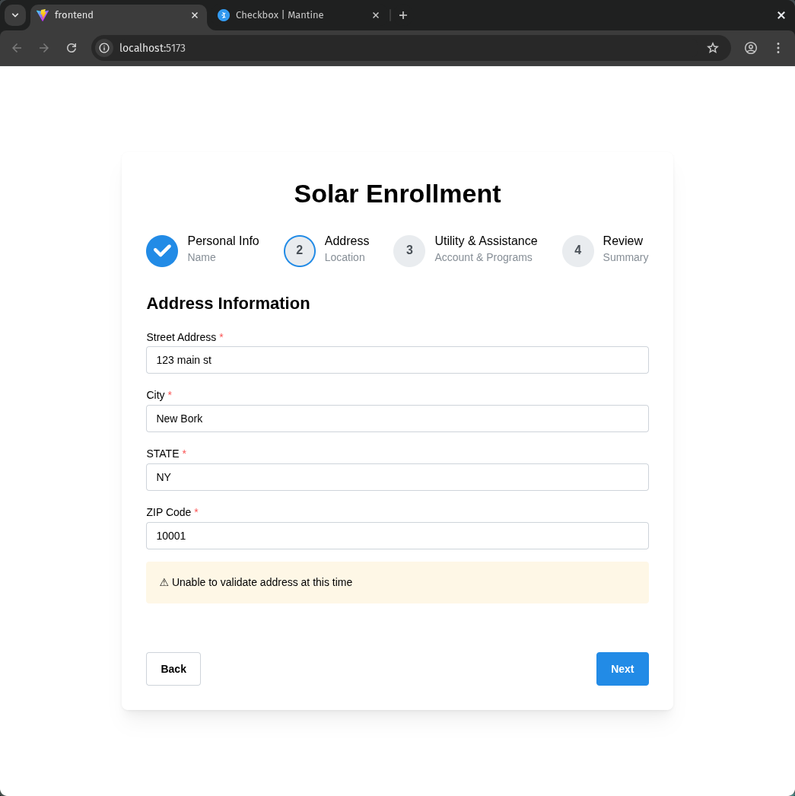
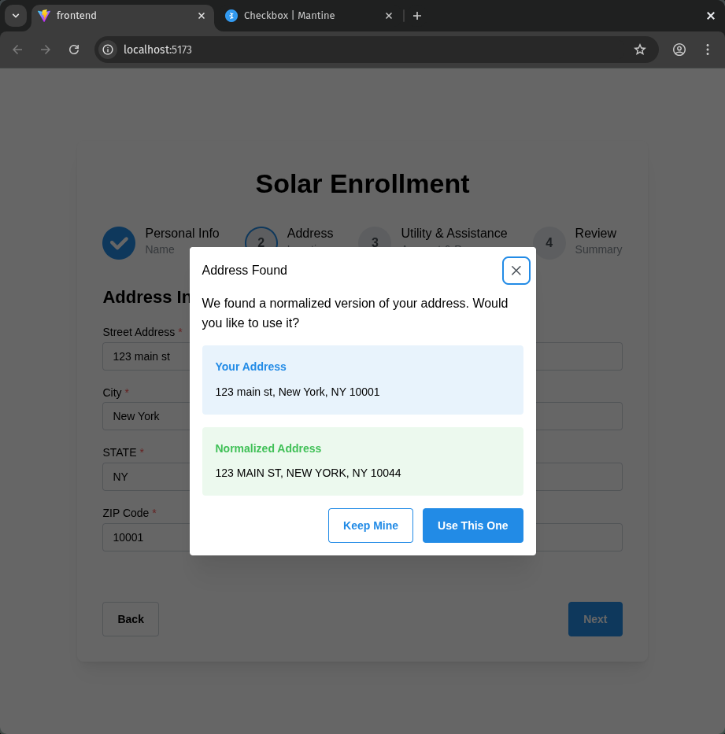
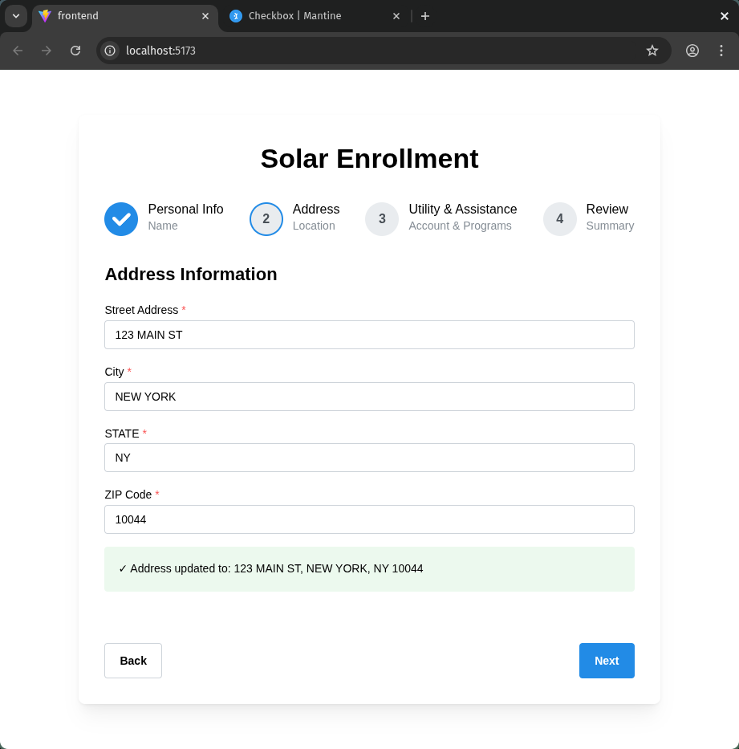
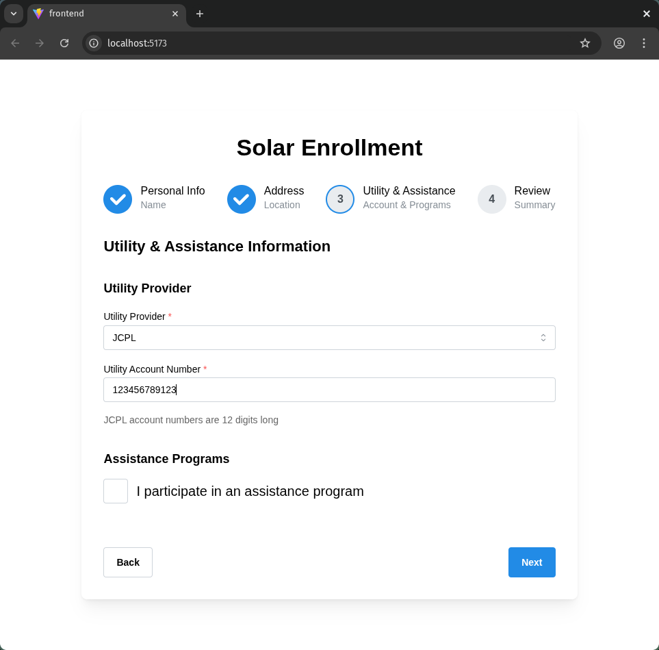
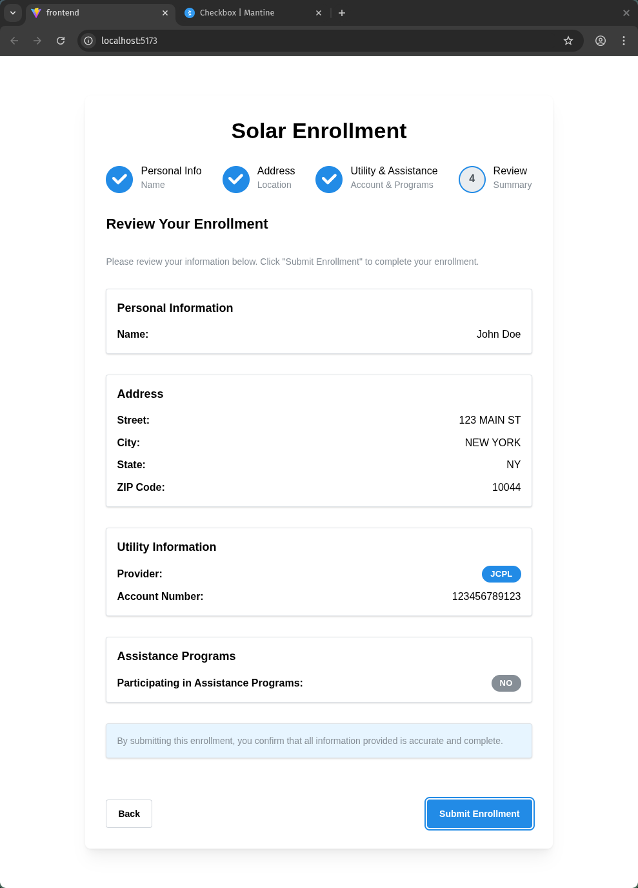
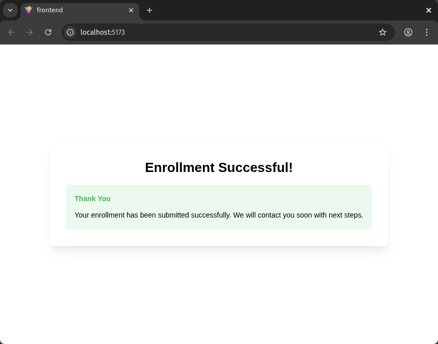

# Solar Enrollment Application

A multi-step enrollment wizard for solar subscribers built with .NET Core backend and React frontend.

## Architecture

- **Backend**: .NET Core 9.0 with FastEndpoints, EF Core, SQLite
- **Frontend**: React 19 + TypeScript with Vite, Mantine UI, React Query
- **Pattern**: Multi-step wizard with browser-based draft storage and live validation

## Features

### Backend
- RESTful API with FastEndpoints (REPR pattern)
- Address validation using US Census Geocoding API
- FluentValidation for comprehensive input validation
- SQLite database with EF Core migrations

### Frontend
- Multi-step wizard interface (4 steps)
- Real-time address validation
- Utility account number validation (PSEG: 10 digits, JCPL: 12 digits, ACE: any)
- Draft auto-save to sessionStorage
- Mobile-first responsive design
- WCAG accessibility compliant


### UI / UX workflow 
      

### Quick Start

assuming you have dotnet and dotnet-ef installed
https://dotnet.microsoft.com/en-us/download
https://github.com/dotnet/efcore

1. **Start the Backend** (Terminal 1):
```bash
cd backend
dotnet restore
dotnet build
dotnet ef database update
dotnet run
```

The API will be available at `http://localhost:5247`.

2. **Generate API Client** (Terminal 2):
```bash
cd frontend
npm install
npm run generate:api
```

3. **Start the Frontend** (Terminal 2):
```bash
npm run dev
```


## API Endpoints

### POST /api/address/validate
Validates an address using the US Census Geocoding API.

**Request:**
```json
{
  "street": "123 Main St",
  "city": "New York",
  "state": "NY",
  "zip": "10001"
}
```

**Response:**
```json
{
  "isValid": true,
  "normalizedAddress": "123 MAIN ST, NEW YORK, NY, 10001",
  "errorMessage": null
}
```

### POST /api/enrollment
Creates a new enrollment.

**Request:**
```json
{
  "firstName": "John",
  "lastName": "Doe",
  "address": "123 Main St",
  "city": "New York",
  "state": "NY",
  "zipCode": "10001",
  "utility": "PSEG",
  "utilityAccountNumber": "1234567890",
  "hasAssistanceProgram": true,
  "assistancePrograms": ["Medicare", "SNAP"]
}
```

**Response:**
```json
{
  "enrollmentId": 1,
  "success": true,
  "message": "Enrollment created successfully"
}
```

## Validation Rules

### Utility Account Numbers
- **PSEG**: Exactly 10 digits
- **JCPL**: Exactly 12 digits
- **ACE**: No validation (any string)

### Assistance Programs
- If `hasAssistanceProgram` is `true`, at least one program must be selected
- Valid programs: `Medicare`, `SNAP`

### Address
- All fields required
- State must be 2-letter abbreviation
- ZIP code must be in format `12345` or `12345-6789`

## Design Decisions

### Draft Data Handling
- Browser sessionStorage for simplicity
- Data persists across page reloads but not across devices
- Cleared on successful submission

### Multi-Step Enrollment
- Improves UX for less technical users
- Breaks complex form into digestible chunks
- Clear progress indication

### Consistency Checks
- Address validated via Census API (soft validation - warnings if invalid but allow proceed)
- UAN validation strict - blocks submission if format wrong for selected utility
- Assistance program requires selection if checkbox enabled

### PII Security
- HTTPS in production (not implemented locally)
- Backend validation to prevent injection
- No logging of sensitive data
- Database at rest (SQLite file permissions)

### Technical Accessibility
- Large, clear labels and buttons
- Inline validation with helpful error messages
- Progress indicator shows completion status
- One focus per step reduces cognitive load
- Mobile-first design works on any device
- WCAG compliant with proper ARIA labels and keyboard navigation


## Project Structure

```
backend/
├── Data/
│   ├── Entities/
│   │   └── Enrollment.cs
│   ├── EnrollmentDbContext.cs
│   └── Migrations/
├── Endpoints/
│   ├── ValidateAddress/
│   └── CreateEnrollment/
├── Services/
│   ├── IAddressValidationService.cs
│   └── AddressValidationService.cs
└── Tests/
    ├── EnrollmentValidatorTests.cs
    └── AddressValidationServiceTests.cs

frontend/
├── src/
│   ├── api/
│   ├── components/
│   │   └── EnrollmentWizard/
│   ├── hooks/
│   │   └── useDraftStorage.ts
│   ├── types/
│   │   └── enrollment.ts
│   └── tests/
│       └── setup.ts
├── orval.config.ts
└── vite.config.ts
```
